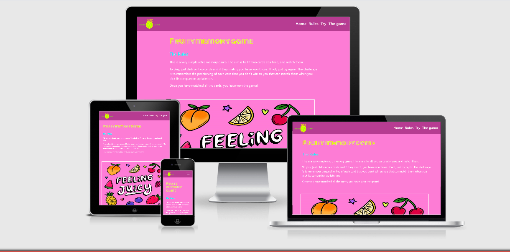
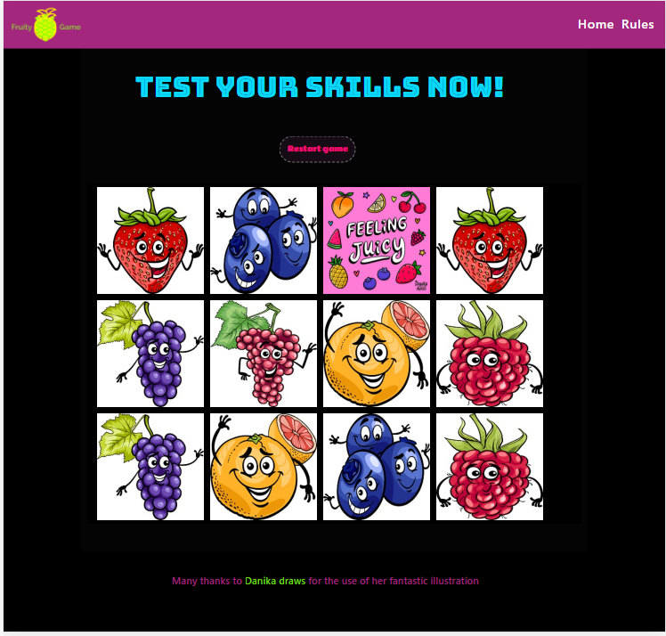

<

  

# Table of Contents :house: 
1. [Introduction](#introduction)
2. [UX](#ux)
3. [Wireframe](#wireframe)
4. [Visual Identity](#visualidentity)    
5. [Site Overview](#siteoverview)
6. [User Stories](#userstories)
7. [Testing](#testing)
8. [Deployment](#deployment)
9. [Code Validation](#codevalidation)
10. [Technologies](#technologies)
11. [Media](#media)
9. [Acknowledgements and thanks](#acknowledgements)

## Introduction 

This site has been built as the Milestone Project 2 for my Code Institute software development diploma.
The aim of the site is to display a digital version of a vintage style memory game, complete with appealling visuals and clear and simple instructions so that 
users can have fun and challenge themselves as well as go through a pleasant visual experience.

## UX 

Since the main element of this site is the memory game, the aim is that the user has a good time and feels 
challenged by playing the card matching game. I also wanted to make the whole experience fun and visually appealling.

When it comes to the structure of the site, I really didn't want to have just one page with the game on its own, but felt 
that it would make sense and improve the experience if I padded this out with some more content and spread it 
over two separate pages. The home page can be a landing page or introduction and then the game page has the
final destination, which is the game.

- **Logo and header**
The logo is a pinneapple and it also includes the name of the site. I really wanted to have a fresh and vibrant logo
which is why I chose this design. The header has a contrasting colour in dark pink which I believe goes very well
with the other colour schemes of the site.
I tried to pick colours that were included in the main image (which is also the back of all the cards) for an effect of 
continuity through the site.
Clicking the logo from the game page takes the user to the home page.

- **Navigation**
The navigation links change colour and font style (to italics) when hovered or clicked, to add an element of dynamism and to 
highlight what is being selected so that the user is able to double check that they are not making a mistake. The navigation bar collapses
when the smaller screens are used so that the visible area is less cluttered. It turns into a hamburger navigation bar.

- **Home page:**
The goal of the main page here was to wrap the main element, the game, in a a bit of content which sets the tone and leads the user to the game itself.
The home page doesn't have a lot in it other than the instructions or rules and some navigation links, as well as a feature image which is supposed
to be fun, vibrant and visually stimulating.
In the header we can find the navigation links to go directly to the 'PLAY NOW' button and also another one that goes straight to the 
game page itself.

The font for the main title was chosen specifically because it reminded me of some retro fonts from years ago and I left the footer plain white because there was already a lot of colour on the rest of the page and I felt that this matched the other
white areas on the home page.
At the bottom of the page we have a button which will then, if clicked, lead the user to the other page which hosts
the game itself. I designed the button with the idea that it would draw the eyes to it due to its vibrancy and dotted border.

- **Game page:**
When the 'PLAY NOW' button is clicked, the second page with the game itself is accessed. In this page we have a very simple layout again with just a header, footer, and the main game 
in the center. The cards are all presented with their back to the user and this is the same image that we had on the home page. Once each card is clicked, if it matches the second card 
they will both remain flipped and stay on the board. 
In order to set a clear difference between the two pages, and because the home page is very colourful and so are the backs of the cards, I decided to make the 
background of the game page black. I believe that this gives it a bit of character and that it makes the othe colours stand out more, providing contrast.

If the two cards clicked at the time do not match, they will flip back to their original state and disappear from view. The user then has to click another two cards to see if these match 
and the same sequence is repeated once more. This will carry on until the user matches all the cards (a total of 12 cards, so 6 matches). When the user gets to the last match, they will 
receive a messsage saying that they have won the game and the game board will disappear from view.
I thought that it would be nice to do it this way rather than as a message which was superimposed over the board.

At the top of the page, in the header, are links to go back to the home page and also a direct shortcut to the rules area

-**Restart button**-
I felt that it would be good for the user experience to provide a 'restart'  button which resets the game to the initial stage, so that the user doesn't need to refresh or reload
the page itself in order to see the new board. This button follows the same styling as the 'PLAY NOW' button which is on the home page with regards to the dotted outline.

## Wireframe 

## Visual Identity 

### Site overview 

Below are a series of images taken which show an overview of all the pages on the site and their different stages:

## User Stories 

**Users:**

## Testing 

**Demo/Testing**

## Deployment 

**Deployment**

This website has been deployed to GitHub Pages as [Fruity Game](https://maxnyla.github.io/fruity-game)

The process for deployment is documented below:

- Log into [GitHub](https://www.github.com)

- Access the page with the repository for this project (https://maxnyla.github.io/fruity-game)

- Click on 'Settings' on the main menu over the file listing

- Navigate down to 'GitHub Pages'

- Select 'Branch: Master' from the menu

- This generates a live link for the website, which is now viewable publicly

## Technologies 

For this project I have used the below technologies:

- [HTML5](https://en.wikipedia.org/wiki/HTML5) for the build of the site

- [CSS3](https://en.wikipedia.org/wiki/CSS) for the styling

- [Javascript](https://en.wikipedia.org/wiki/Javascript) for the interactive elements of the site

- [Gitpod](https://www.gitpod.io)
    Since I am typing this text through Gitpod, I figured it would go first in the list. All code was created through Gitpod and the workspace for this project resides there.

- [GitHub](https://www.github.com)
    This has been used to host and deploy the project.

- [Bootstrap](https://getbootstrap.com)
    Used for their grid system, navbars, etc. I have also on many occasions modified the initial system for styling purposes.

- [FontAwesome](https://fontawesome.com)
    Used for the cup icon, which I have used on both pages.

- [Cloudflare](https://www.cloudflare.com) 
    Used for the scripts

- [Code Beautify CSS beautifier](https://codebeautify.org)
    Used to make my CSS look nicer and tidier

- [Beautify Tools HTML beautifier](http://beautifytools.com/html-beautifier.php)
    Used to make my HTML tidier 

- [W3C Markup Validation Service](https://validator.w3.org)
    Used to check my HTML code
    
- [CSS Validation Service](https://jigsaw.w3.org/css-validator)
    Used to check my CSS code

I have also used the Chrome Developer Tools extensively throughout the project. They have been very useful for each change that I made, and to double-check my ideas before implementing them. 
I have used the javascript console logging utility to check code before saving it and to troubleshoot.

## Media 

I have taken advantage of several useful resources for images and my logo. Please see below:

- [Logo Makr](https://logomakr.com/) 
    for the logo design

- [Vectorstock](https://www.vectorstock.com/) 
    I used this for the cute fruit images

- [Font Awesome](https://fontawesome.com/6?next=%2Fstart) 
    for the icon used on this project

- [Am I Responsive](http://ami.responsivedesign.is/) 
    for the image used in the UX section showing the different screen sizes.

- [Favicon](https://www.favicon.io)
    for the thumbnail icon on the internet tab header

- [Danika Draws](https://www.instagram.com/danika_draws)
    My friend Danika allowed me to use her illustration as the image on the back of the cards and also as 
    feature on the main page since I found that it was a perfect fit for my project

## Acknowledgements and thanks 

I would like to mention all the different resources and sites that are out there, with their respective communities, which have been a huge help for me. 
Some of them are:

- Bootstrap
- Git Hub and Git Pod
- w3schools
- Font Awesome
- jQuery developers
- LogoMakr
- Stack Overload
- Slack 
- Google (for all the things that I've looked up during this project, which have led me to all these amazing sites)
- Thanks to Danika for letting me use her fantastic illustration
- Of course I must mention my fantastic mentor Felipe Souza Alarcon for all his patience, help and ideas during this project, and his flexibility and availability. Always much 
appreciated.

And lastly, I could not leave out the Code Institute team: the other students on Slack, the tutor support and all the mentors who are always welcoming and trying to help.

:house:[ Back to Table of Contents](#home)
