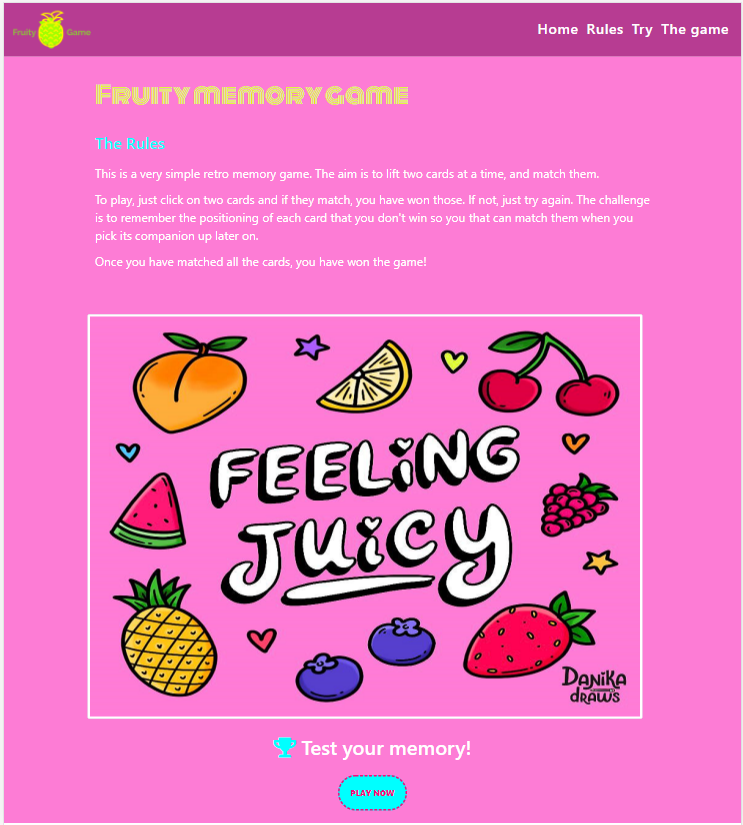
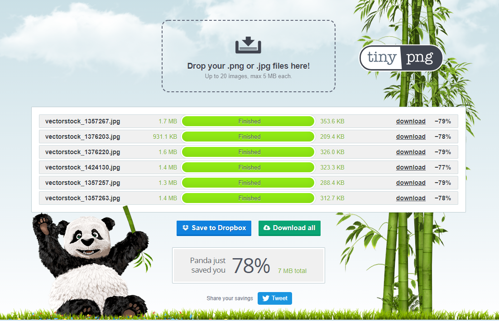
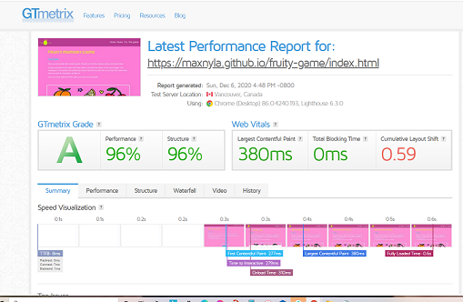
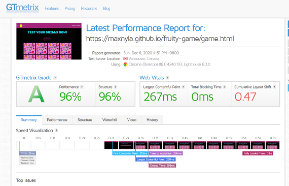

<

  

# Table of Contents :house: 
1. [Introduction](#introduction)
2. [UX](#ux)
3. [Wireframes](#wireframes)
4. [Visual Identity](#visualidentity)    
5. [Site Overview](#siteoverview)
6. [User Stories](#userstories)
7. [Testing](#testing)
8. [Deployment](#deployment)
9. [Code Validation](#codevalidation)
10. [Technologies](#technologies)
11. [Media](#media)
9. [Acknowledgements and thanks](#acknowledgements)

## Introduction 

This site has been built as the Milestone Project 2 for my Code Institute software development diploma.
The aim of the site is to display a digital version of a vintage style memory game, complete with appealling visuals and clear and simple instructions so that 
users can have fun and challenge themselves as well as go through a pleasant visual experience.

## UX 

Since the main element of this site is the memory game, the aim is that the user has a good time and feels 
challenged by playing the card matching game. I also wanted to make the whole experience fun and visually appealling.

When it comes to the structure of the site, I really didn't want to have just one page with the game on its own, but felt 
that it would make sense and improve the experience if I padded this out with some more content and spread it 
over two separate pages. The home page can be a landing page or introduction and then the game page has the
final destination, which is the game.

**Logo and header**

- The logo is a pinneapple and it also includes the name of the site. I really wanted to have a fresh and vibrant logo
  which is why I chose this design. The header has a contrasting colour in dark pink which I believe goes very well
  with the other colour schemes of the site.

- I tried to pick colours that were included in the main image (which is also the back of all the cards) for an effect of 
  continuity through the site.
  Clicking the logo from the game page takes the user to the home page.

**Navigation**

- The navigation links change colour and font style (to italics) when hovered or clicked, to add an element of dynamism and to 
  highlight what is being selected so that the user is able to double check that they are not making a mistake. The navigation bar collapses
  when the smaller screens are used so that the visible area is less cluttered. It turns into a hamburger navigation bar.

**Home page**

- The goal of the main page here was to wrap the main element, the game, in a a bit of content which sets the tone and leads the user to the game itself.
  The home page doesn't have a lot in it other than the instructions or rules and some navigation links, as well as a feature image which is supposed
  to be fun, vibrant and visually stimulating.
  In the header we can find the navigation links to go directly to the 'PLAY NOW' button and also another one that goes straight to the 
  game page itself.

- The font for the main title was chosen specifically because it reminded me of some retro fonts from years ago and I left the footer plain white because there was already a lot of colour on the rest of the page and I felt that this matched the other
  white areas on the home page.
- At the bottom of the page we have a button which will then, if clicked, lead the user to the other page which hosts
  the game itself. I designed the button with the idea that it would draw the eyes to it due to its vibrancy and dotted border.

**Game page**

- When the 'PLAY NOW' button is clicked, the second page with the game itself is accessed. In this page we have a very simple layout again with just a header, footer, and the main game 
  in the center. The cards are all presented with their back to the user and this is the same image that we had on the home page. Once each card is clicked, if it matches the second card 
  they will both remain flipped and stay on the board. 
  In order to set a clear difference between the two pages, and because the home page is very colourful and so are the backs of the cards, I decided to make the 
  background of the game page black. I believe that this gives it a bit of character and that it makes the othe colours stand out more, providing contrast.

- If the two cards clicked at the time do not match, they will flip back to their original state and disappear from view. The user then has to click another two cards to see if these match 
  and the same sequence is repeated once more. This will carry on until the user matches all the cards (a total of 12 cards, so 6 matches). When the user gets to the last match, they will 
  receive a messsage saying that they have won the game and the game board will disappear from view.
  I thought that it would be nice to do it this way rather than as a message which was superimposed over the board.

- At the top of the page, in the header, are links to go back to the home page and also a direct shortcut to the rules area

**Restart button**

- I felt that it would be good for the user experience to provide a 'restart'  button which resets the game to the initial stage, so that the user doesn't need to refresh or reload
  the page itself in order to see the new board. This button follows the same styling as the 'PLAY NOW' button which is on the home page with regards to the dotted outline.

## Wireframes 

All the wireframes were created with [Microsoft Paint](https://jspaint.app/)

I created two wireframes for each page: one home page for the mobile view and another for the desktop view, and the same for the game page. 
In addition to this, I created an extra wireframe for the game page after the user receives the messsage letting them know that they have won the game, since there is 
a substantial change to the page design at that point. Again, this wireframe was made for mobile view and desktop view. 

* The wireframes can be found here:

[All wireframes for MS2 Fruity Game](https://github.com/maxnyla/fruity-game/tree/master/assets/wireframes)

[Home page wireframe web](https://github.com/maxnyla/fruity-game/tree/master/assets/wireframes/1-home_web.png)

[Home page wireframe mobile](https://github.com/maxnyla/fruity-game/tree/master/assets/wireframes/2-home_mob.png)

[Game page wireframe web](https://github.com/maxnyla/fruity-game/tree/master/assets/wireframes/3-game_web.png)

[Game page wireframe mobile](https://github.com/maxnyla/fruity-game/tree/master/assets/wireframes/4-game_mob.png)

[Game finished page wireframe web](https://github.com/maxnyla/fruity-game/tree/master/assets/wireframes/5-game_done_web.png)

[Game finished page wireframe mobile](https://github.com/maxnyla/fruity-game/tree/master/assets/wireframes/6-game_done_mob.png)

## Visual Identity 

I used LogoMakr to design the logo. 

- I wanted to use an image of a fruit but wanted it to be one of the fruits in the main central illustration so I searched 
  for a few different fruits and I felt like this pinneaple could fit the theme very well. I could make it yellow, and match other elements of the site such as the header, etc. I added the name of the game ('Fruity Game')
  in a colour that complements it.

- For the rest of the site, as always, I like vibrant colours and I felt that they went well with this type of website so I gave it all
  a very fresh, bright, vibrant air.

- I did not want to risk over saturation though so I tried to tie the colours together and use the same ones a few times so that there was some continuity around the site and to avoid colour exhaustion.

- The buttons are very similar in structure although I did tailor them to their specific pages and I also used colour to unify things around the site with the hover behaviour of links. With regards to the navigation links, in addition to the colour I also set these to briefly change to italics for added effect.

- I also wanted to keep the site's visual identity unified by using mostly the same header and footer for all the pages. The home page and the game page have a different (reversed) colour scheme though due to the fact that the background colours on their main central page areas are so different.

### Site overview 

Below are a series of images taken which show an overview of all the pages on the site and their different stages:

**Home page:**

**Game page before game starts:**

**Game page with all cards matched and game about to be completed:**

**Game page once game has been won:**

Because there are many images in this project, and for the purpose of improving user experience, I have compressed the images using [tinypng.com](https://tinypng.com/) 

As can be seen below, the total reduction in image size on this site has been 53% (7MB).

## User Stories 

The different goals and aims of the game, when viewed from a user perspective or the site owner's perspective are below.

**Users:**

- Users want to have a clear site that they can easily navigate, which is uncluttered and therefore does not have unnecessary elements 

- Users just want clear instructions presented in an easy to see manner 

- Users want to have a very quick overview of the site and how it works as soon as they land on the home page

- Users want to be able to easily navigate to the main (game) element of the site 

- Users want a responsive, fun and visually appealling game

- Users want the game to be intuitive and therefore have the correct functionality to avoid clicking cards that cannot be clicked, or too many at the time, etc

- Users want a clear message stating that they have finished the game

- Users want a clear indication of where or how they can start the game again if they wish to do so

**Site owner:**

- The site owner's main goal is that the user has a great experience and has fun

- The site owner wants the navigation through the site to be clear and easy

- The site owner wants the game and the site to be intuitive so instructions can be kept to a bare minimum

- The site owner wants all the necessary information for the user to complete the game to be readily accessible and easy to understand

- The site owner wants the visuals of the game to be appealling and for the colours and design of the site to draw the user in

- The site owner wants the user to have a clear message once the game is finished

- The site owner wants to make it straightforward for the user to restart the game when desired

## Testing 

This website has been tested through the GTMetrix site, [GTmetrix](https://gtmetrix.com).
Below is a screenshot of the results achieved for each page. Page speed score was 96% and the time to fully load the site was 1.6s.

**Demo/Testing**

I have deployed the site on a number of occasions throughout the building process, so that I could test it from different devices such as my mobile and tablet and check for responsiveness.

During this testing I realised that I had to make some design changes to areas that I was not satisfied with, and I made a number of changes to the page layouts and the colours and fonts used.
Also, I made many changes as I went along in order to make it more responsive or easier to navigate.

The biggest challenge was to decide which functionality I should add to the game. I tried and tested it many times to fet a feel for what the best course of action was with regards to timing of cards,
and also the behaviour of the cards once they matched or had been clicked. I had to adapt to the mobile screens and change the layout of the tiles in the game board slightly so that 
the cards were still visible and the game was easy to play on those devices as well.

I made changes to the colour scheme a few times because I was not happy with what I had at the time, and I wanted to differentiate the two pages visually so it was clear to the user which page they were in
at any given point. 

During the testing process, I tested the site and game on a number of platforms: 

- on a desktop via Chrome, Edge, Firefox and Opera. I checked different screen sizes and resolutions and also used 
a simulator
- on an Android mobile phone
- on an Android tablet

I asked others to test with Mac devices and the feedback that I received was that the game works well with the Mac ioS but not with the iPhone. 
After some investigation, I believe that the issue is the way the iPhone handles some of the CSS properties. I found extensive reports of this issue online and the consensus to fix this seems to be that 
it is necessary to add the -webkit- additions to the transform and perspective properties in the css file. I tried doing this but to date I believe it is still not working correctly on the iPhone.

- Future deployment ideas:

I had in mind to make a counter which displays how many cards have been flipped, and also a timer that records the time, and perhaps sets a limit to the time that the user 
has to complete the game. I was unable to do this as I ran out of time but it remains an idea for future development of the game as my skills progress and my speed as a coder as well.

## Deployment 

**Deployment**

This website has been deployed to GitHub Pages as [Fruity Game](https://maxnyla.github.io/fruity-game)

It was deployed ahead of time and modified on a number of occasions so that I would be able to check how things worked on different devices, and to ask others to test it themselves. 

The process for deployment is documented below:

- Log into [GitHub](https://www.github.com)

- Access the page with the repository for this project (https://maxnyla.github.io/fruity-game)

- Click on 'Settings' on the main menu over the file listing

- Navigate down to 'GitHub Pages'

- Select 'Branch: Master' from the menu

- This generates a live link for the website, which is now viewable publicly

### Code validation 

I ran all my code through the  [W3C Markup Validation Service](https://validator.w3.org), the [CSS Validation Service](https://jigsaw.w3.org/css-validator) and the [Online Javascript Validator](http://beautifytools.com/javascript-validator.php)

This gave me a few errors on the css stylesheet that required making changes to the code. Some of them were related to the colour property as I had used the wrong code and others had to do with properties set in the wrong order (non alphabetical). I also had some 
superfluous items in the js code and alerts referring to older IE versions.

Links to the results of the last validation completed can be found below:

[Home page HTML](assets/code_validation/1-index_html_validator.png)

[Game page HTML](assets/code_validation/2-game_html_validator.png)

[CSS](assets/code_validation/3-css_validator.png)

[JS](assets/code_validation/4-js_validator.png)

## Technologies 

For this project I have used the below technologies:

- [HTML5](https://en.wikipedia.org/wiki/HTML5) for the build of the site

- [CSS3](https://en.wikipedia.org/wiki/CSS) for the styling

- [Javascript](https://en.wikipedia.org/wiki/Javascript) for the interactive elements of the site

- [Gitpod](https://www.gitpod.io)
    Since I am typing this text through Gitpod, I figured it would go first in the list. All code was created through Gitpod and the workspace for this project resides there.

- [GitHub](https://www.github.com)
    This has been used to host and deploy the project.

- [Bootstrap](https://getbootstrap.com)
    Used for their grid system, navbars, etc. I have also on many occasions modified the initial system for styling purposes.

- [FontAwesome](https://fontawesome.com)
    Used for the cup icon, which I have used on both pages.

- [Cloudflare](https://www.cloudflare.com) 
    Used for the scripts

- [Code Beautify CSS beautifier](https://codebeautify.org)
    Used to make my CSS look nicer and tidier

- [Beautify Tools HTML beautifier](http://beautifytools.com/html-beautifier.php)
    Used to make my HTML tidier 

- [W3C Markup Validation Service](https://validator.w3.org)
    Used to check my HTML code
    
- [CSS Validation Service](https://jigsaw.w3.org/css-validator)
    Used to check my CSS code

I have also used the Chrome Developer Tools extensively throughout the project. They have been very useful for each change that I made, and to double-check my ideas before implementing them. 
I have used the javascript console logging utility to check code before saving it and to troubleshoot.

## Media 

I have taken advantage of several useful resources for images and my logo. Please see below:

- [Logo Makr](https://logomakr.com/) 
    for the logo design

- [Vectorstock](https://www.vectorstock.com/) 
    I used this for the cute fruit images

- [Font Awesome](https://fontawesome.com/6?next=%2Fstart) 
    for the icon used on this project

- [Am I Responsive](http://ami.responsivedesign.is/) 
    for the image used in the UX section showing the different screen sizes.

- [Favicon](https://www.favicon.io)
    for the thumbnail icon on the internet tab header

- [Danika Draws](https://www.instagram.com/danika_draws)
    My friend Danika allowed me to use her illustration as the image on the back of the cards and also as 
    feature on the main page since I found that it was a perfect fit for my project

## Acknowledgements and thanks 

I would like to mention all the different resources and sites that are out there, with their respective communities, which have been a huge help for me. 
Some of them are:

- Bootstrap
- Git Hub and Git Pod
- w3schools
- Font Awesome
- jQuery developers
- LogoMakr
- Stack Overload
- Slack 
- Google (for all the things that I've looked up during this project, which have led me to all these amazing sites)
- Thanks to Danika for letting me use her fantastic illustration
- Of course I must mention my fantastic mentor Felipe Souza Alarcon for all his patience, help and ideas during this project, and his flexibility and availability. Always much 
appreciated.

And lastly, I could not leave out the Code Institute team: the other students on Slack, the tutor support and all the mentors who are always welcoming and trying to help.

:house:[ Back to Table of Contents](#home)
